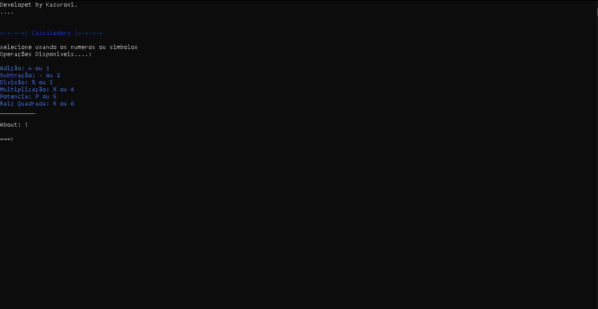

# ProjetoCalculadora
Este Programa foi criado com a intenção de ajuda com continhas matemáticas em diversos tipos de situação

--Interface--

---

--Download--

(faça download do arquivo a baixo )
(em seguida descompacte a o arquivo na pasta desejada)
(execute o arquivo e aproveite)

[Download do arquivo .zip](dist/ProjetoCalculadora.deps.zip)
Ou se você estiver no Windows, é possivel dar um duplo-clique no ícone do programa.
dotnet Projeto_calculadora.dll

## Agradecimentos

- [Etec Adolpho Berezin](https://eteab.com.br)
- [Prof. Diego Neri](https://github.com/diegoneri)
- [Prof. Ermogenes](https://github.com/ermogenes)
- [Dev C#](https://github.com/ermogenes/aulas-programacao-csharp)